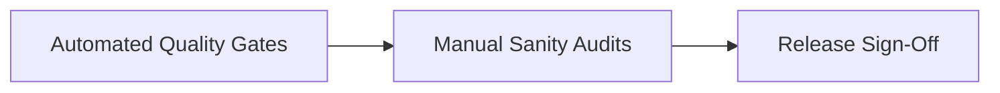

# EasyCord Pre-Release Checklist

This playbook defines the definitive manual and automated checks maintainers must execute before shipping any formal production versions of EasyCord.

## Release Process Overview



## 1. Automated Tooling Gates

Ensure the CI pipelines return clean slates before proceeding.

* **Unit Tests:** All unit tests must clear across the target Python matrix (3.10, 3.11, 3.12).
    ```bash
    pytest tests/
    python scripts/verify_plugin_tests.py
    ```
* **Type Checking:** Pyright must pass cleanly.
    ```bash
    pyright easycord/ tests/ --warnings
    ```
* **Linting:** Ruff must return zero critical rule violations.
    ```bash
    ruff check easycord tests --select E9,F63,F7,F82
    ```

## 2. Version Synchronization Checks

Enforce strict matches between versions declared across the ecosystem:

* **`pyproject.toml`**: Check the `version` field.
* **`easycord/__init__.py`**: Check the `__version__` string.
* **Documentation**: Ensure any documented versions align with the targeted release.

Run the automated metadata checker to catch drift:
```bash
python scripts/check_release_metadata.py
```

## 3. Manual & Architectural Audits

Before release sign-off, maintainers must perform the following manual audits:

* **Changelog Review:** Review automatically compiled `CHANGELOG.md` data. Explicitly check for any missing breaking change declarations.
* **Security & Prompt Injection:** Run a targeted manual audit focusing on prompt-injection exposure vectors or access control flaws within plugin systems (specifically `ai_moderator.py`).
* **Dependency Evaluation:** Evaluate third-party dependencies in `pyproject.toml` for outdated version pins or known vulnerabilities.

## 4. Release Sign-Off

Once all gates are cleared, tag the release and publish to PyPI:
```bash
git tag v5.x.x
git push --tags
python -m build
twine upload dist/*
```
